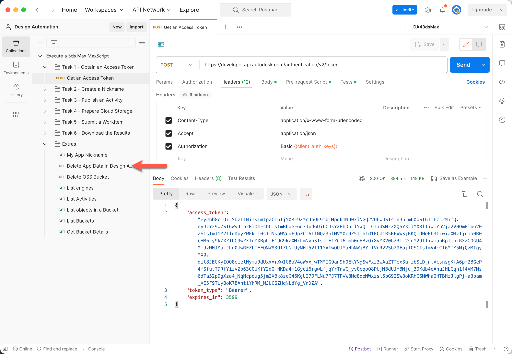
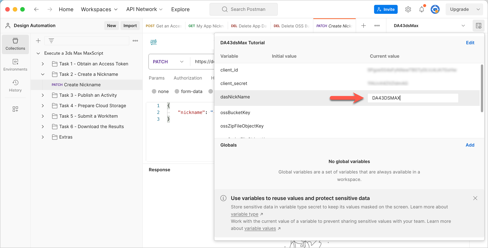
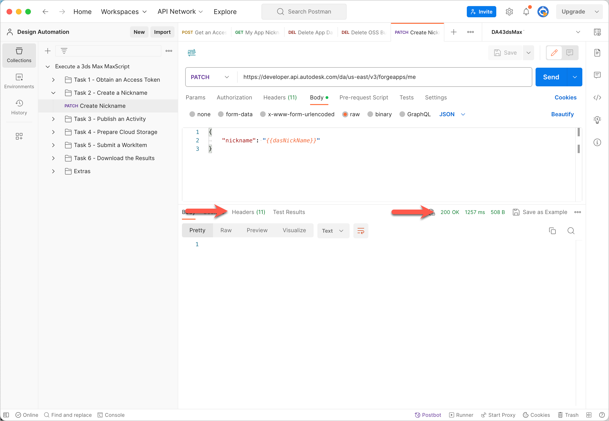

# Task 2 - Create a Nickname

APS uses the Client ID to uniquely identify an app. The Client ID can be long and cryptic, and hence a source of irritation when you reference your app.

A *Nickname* lets you map a Client ID to an easy-to-use name that you can use in place of the Client ID. This tutorial uses the `dasNickName` environment variable in Postman to store the Nickname.

**Notes:**

- Once you add data to an App, you are not allowed to set a nickname for the app. The only way you can assign a nickname to an app with data is by first calling the `[DELETE] /forgeapps/me`. This action deletes all data associated with that app, including any existing nickname. The request **Extras > Delete App Data in Design Automation** in this Postman Collection calls (`[DELETE] /forgeapps/me`) and clears the app of all data.

    

- If you get stuck while working on this tutorial, and are unable to proceed, use this request to clear all data from the app, and restart from Task 1.

- Nicknames cannot contain spaces, and must be globally unique.  If the nickname is already in use, even by someone else, APS returns a `409 Conflict` error when you try to set the Nickname.

## Save the Nickname to a variable

1. Click the **Environment quick look** icon (the eye icon) on the upper right corner of Postman.

2. In the **CURRENT VALUE** column, in the **dasNickName** row, enter a Nickname for your app.

   

3. Click the **Environment quick look** icon again, to hide the variables.

## Send a request to set the Nickname

1. On the Postman sidebar, click **Task 2 - Create a Nickname > PATCH Create Nickname**. The request loads.

2. Click **Send**. If the request is successful, you will get a return Status of **200 OK**, and you should see a response similar to the following image. The response has only a header and no body.

    

[:rewind:](../readme.md "readme.md") [:arrow_backward:](task-1.md "Previous task") [:arrow_forward:](task-3.md "Next task")
