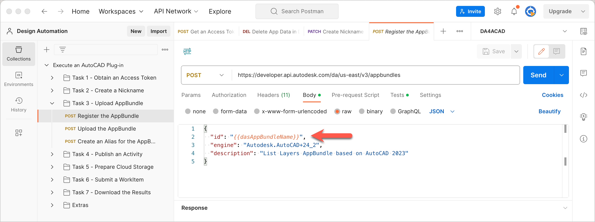
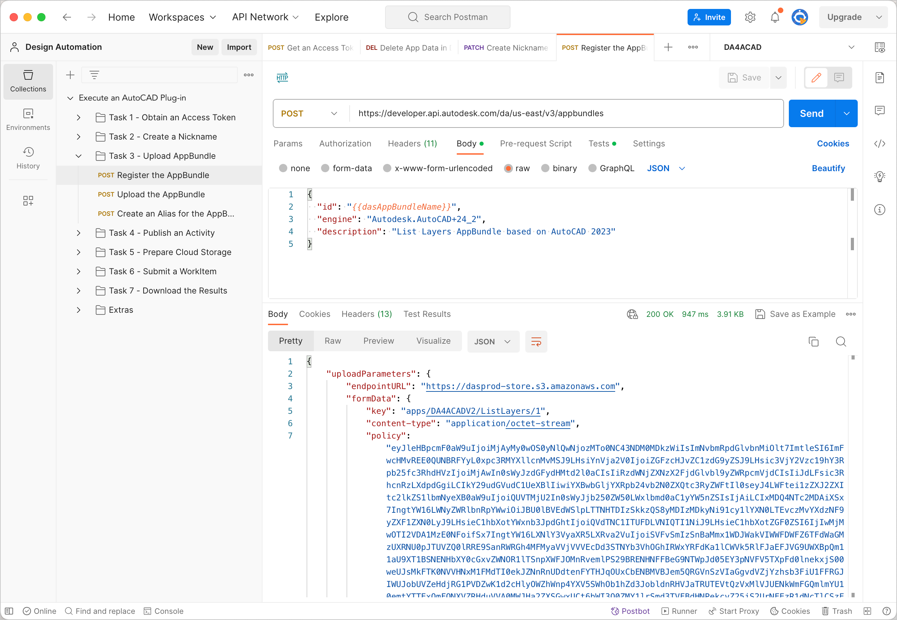
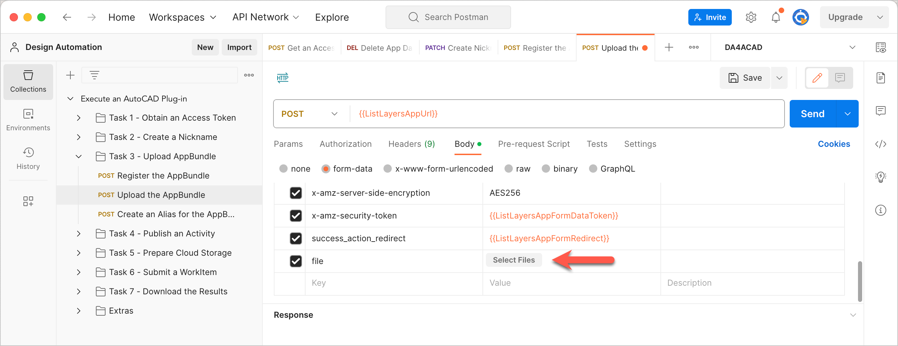
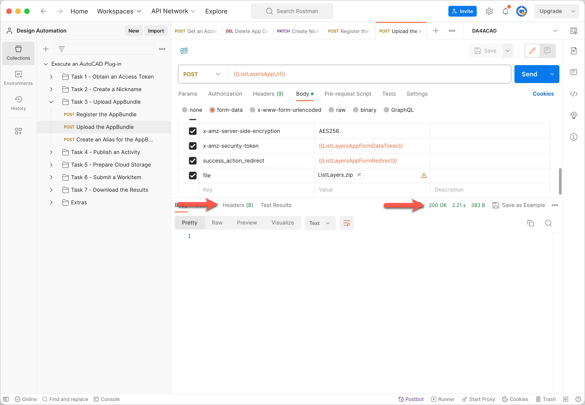
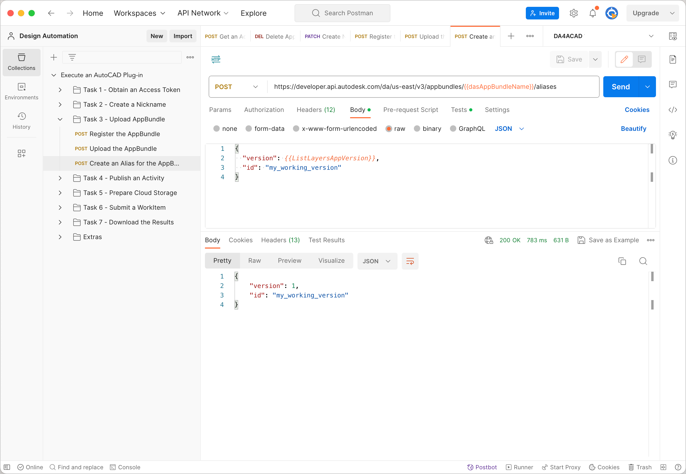

# Task 3 - Upload an AppBundle to Design Automation

An AppBundle is a package of binaries and supporting files that contains the custom commands you want to run. For this walkthrough, you will use an AppBundle named *ListLayers.zip*  that is stored in the [*walkthrough_data* folder of this repository](../walkthrough_data). This AppBundle contains an AutoCAD plug-in, *command.dll*. This plug-in implements a custom command named **LISTLAYERS**, which extracts layer names from the current drawing, and writes the names to a text file. See the corresponding [task in the How-to Guide on the APS developer portal](https://aps.autodesk.com/en/docs/design-automation/v3/tutorials/autocad/task-3-upload-appbundle/) to learn how to create an AppBundle.

## Download the AppBundle

- Download *ListLayers.zip* from the [*walkthrough_data* folder of this repository](../walkthrough_data).

## Register the AppBundle

When registering the AppBundle, you provide a name for the AppBundle (the id), and specify that it must run on AutoCAD 2023. The name can be different to the name of the AppBundle zip file.

1. On the Postman sidebar, click **Task 3 - Upload AppBundle > POST Register the AppBundle**. The request loads.

2. This request picks up the AppBundle name from the Postman Environment Variable `dasAppBundleName`. Set this variable to the name *ListLayers*.

    **Note:** You can use any name you want. However, in order to match the screen captures and the cURL walkthrough in the APS developer portal, this walkthrough uses the name *ListLayers*.

    1. Click the **Environment quick look** icon on the upper right corner of Postman.

    2. In the **CURRENT VALUE** column, in the **dasAppBundleName** row, enter ListLayers.

    3. Click the **Environment quick look** icon again.

3. Click the **Body** tab, and verify that the `id`, is set to the `dasAppBundleName` variable and `engine` is set to `Autodesk.AutoCAD+24_2` (AutoCAD 2023).

    

4. Click **Send**. If the request is successful, you see a screen similar to the following image:

    

    `uploadParameters` shown in the preceding image contains the information required to upload the AppBundle to APS. This information is saved to a series of Postman Collection Variables, so that they can be reused in the next step.

## Upload the AppBundle

1. On the Postman sidebar, click **Task 3 - Upload AppBundle > POST Upload the AppBundle**. The request loads.

2. Click the **Body** tab, and scroll down such that the **file** row is visible.

3. Click **Select Files**, and pick *ListLayers.zip*, which you downloaded earlier.

    

5. Click **Send**. You should see a screen similar to the following. The response has only a header and no body.

    

## Create an Alias for the AppBundle

When you registered the AppBundle earlier, it was registered as version 1 of the AppBundle. Now, you create an alias named *my_working_version* to reference that version.

1. On the Postman sidebar, click **Task 3 - Upload AppBundle > POST Create an Alias for the AppBundle**. The request loads.

2. Click the **Body** tab and note how `id` is set to`my_working_version`.

    

3. Click **Send**. You should see a response similar to the following image.

    

[:rewind:](../readme.md "readme.md") [:arrow_backward:](task-2.md "Previous task") [:arrow_forward:](task-4.md "Next task")
