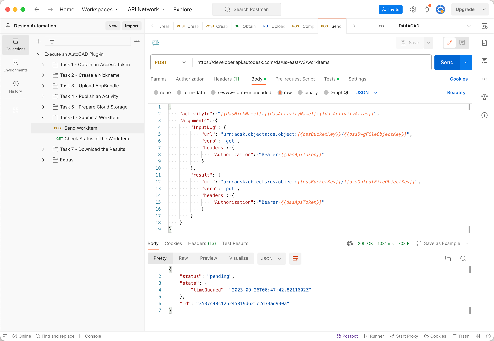
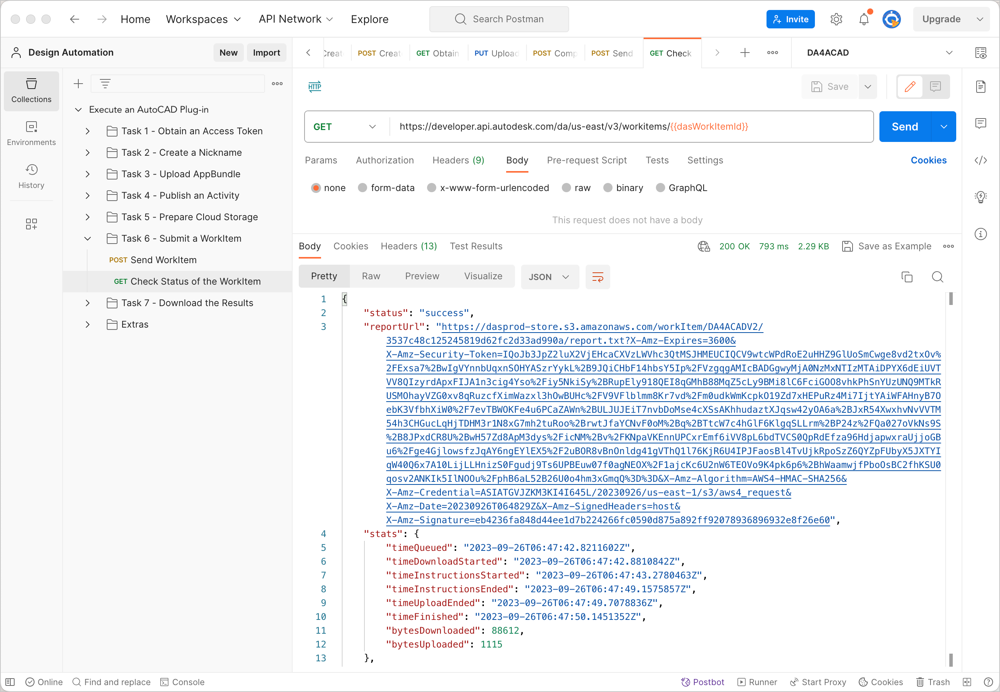

# Task 6 - Submit a WorkItem

When you submit a WorkItem to Design Automation, you are instructing Design Automation to execute the Activity specified in the WorkItem.

The relationship between an Activity and a WorkItem can be thought of as the relationship between a “function definition” and “function call”.
Named parameters on the Activity have corresponding named arguments on the WorkItem.
Like in function calls, optional parameters of the Activity can be skipped and left unspecified while posting a WorkItem.

For this exercise, you create a WorkItem to execute the Activity ListLayers. The WorkItem uses the dwg file you uploaded in the previous task as the input for the Activity. The request downloads the dwg file using its URN, which is stored in the Collection Variable `ossDwgFileUrn`.

## Create a WorkItem

1. On the Postman sidebar, click **Task 6 - Submit a WorkItem > Create a WorkItem**. The request loads.

2. Click the **Body** tab and observe how the Activity ID, the input file, and the output file are specified.

3. Click **Send**. If the request is successful you should see a screen similar to the following image.

    

    The main attributes on the JSON payload are:

    - `activityId` - Specifies what Activity to execute. The id you specify here must be a fully qualified id. A fully qualified id is made up of three parts. They start with the Nickname of the app (or the Client Id of the app. The Nickname is followed by the '.' character, which in turn is followed by the Activity name. This is followed by the '+' character and finally the Activity Alias. For more information on fully qualified ids and unqualified ids, see the [documentation on ids](https://aps.autodesk.com/en/docs/design-automation/v3/developers_guide/aliases-and-ids/#ids).

    - `arguments` - Contains all the parameters that need to be passed to the Activity specified by `activityId`. They must match the parameters you specified in Task 4, when you created the Activity.

    - `InputDwg` - Specifies the URN of the input dwg file for the Activity. The value specified here is contained in the Postman variable `ossDwgFileSignedUrl`.

    **Note** Had you uploaded a zip file instead of a dwg file, you would have been required specify the `pathInZip` attribute. This attribute specifies the path to the dwg file within the zip file.

    - `result` - Specifies the URN  of the output file resulting from the activity. It is constructed by combining the Object ID of the resulting text file with the bucket key and the key statement `urn:adsk.objects:os.object:`.

## Check Status of a WorkItem

Design Automation WorkItems are queued before they are processed. Processing itself can take time. Once processing is done, you need to know if the WorkItems ran successfully or not. As such it is important for you to check the status of the WorkItem you created.

1. On the Postman sidebar, click **Task 7 - Submit a WorkItem > Check Status of a WorkItem**. The request loads.

2. Click **Send**. You should see a screen similar to the following image.

    

**Note:** The best practice is to use the `onComplete` argument when submitting a WorkItem. The `onComplete` argument enables you to specify a callback URL, which is invoked when execution completes. For more information on the argument, see the [documentation on Callbacks](https://aps.autodesk.com/en/docs/design-automation/v3/developers_guide/callbacks/#oncomplete-callback).

[:rewind:](../readme.md "readme.md") [:arrow_backward:](task-5.md "Previous task") [:arrow_forward:](task-7.md "Next task")
