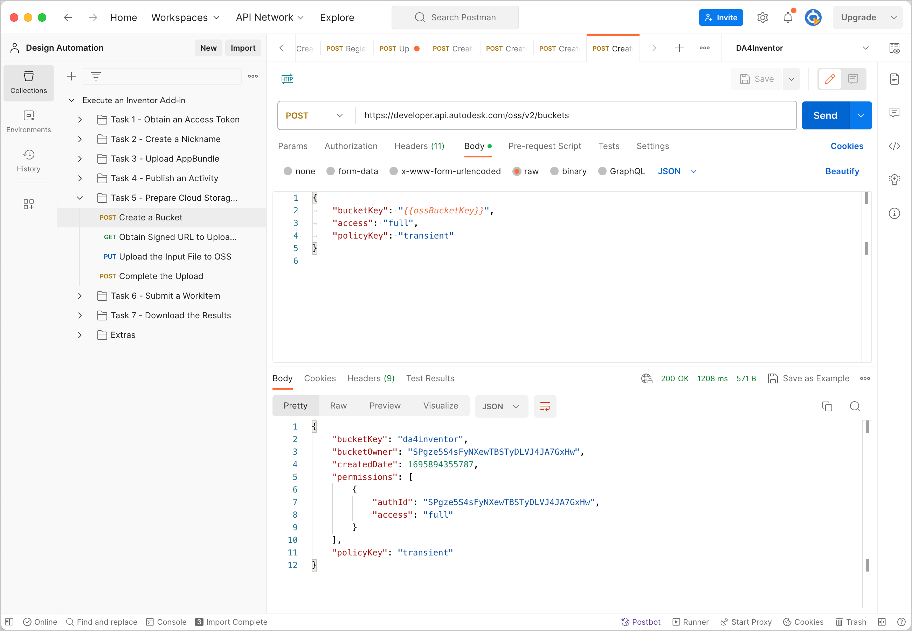
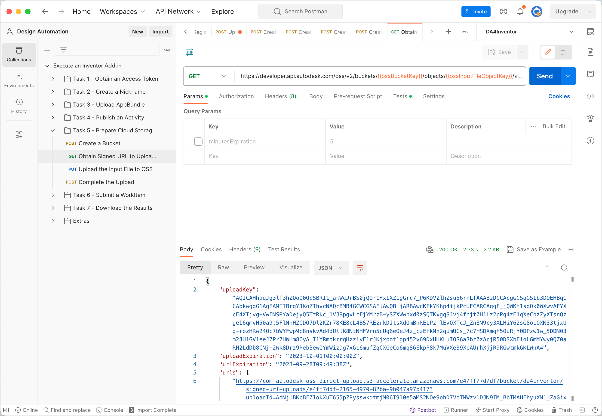
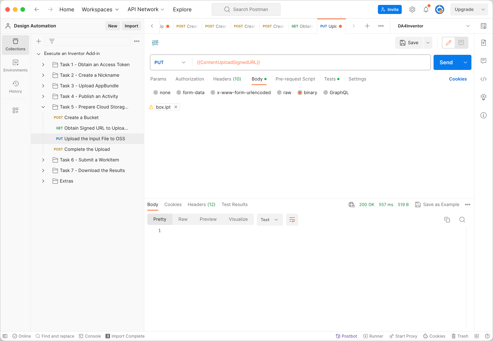

# Task 5 - Prepare cloud storage

The Activity `ChangeParamActivity` resizes an Inventor part or assembly to a height and width you specify (as a JSON object). It also produces an image of the resized part or assembly. In this task, you prepare a cloud storage service to hold the input Inventor files, and the output (resized) Inventor files and image file. While you can use any cloud storage service for this purpose, this tutorial uses the Object Storage Service (OSS) through the Data Management API.

This tutorial provides instructions to assist you resize an Inventor part. We encourage you to try resizing an Inventor Assembly on your own, later.

There are five Postman Environment Variables you must specify for this task. They are
- `ossBucketKey` - The Bucket Key for the Bucket that holds your files in the cloud.
- `ossInputFileObjectKey` - The Object Key of the Inventor Part file.
- `ossOutputIptFileObjectKey` - The Object Key of the placeholder for the resized part the activity produces.
- `ossOutputBmpFileObjectKey` - The Object Key of the placeholder for the image file the activity produces.

If you are using an Inventor Assembly file as an input, you must specify the following Postman Environment as well:

- `ossOutputIamFileObjectKey` - The Object Key of the placeholder for the resized assembly the activity produces.

## Create a Bucket

1. Click the **Environment quick look** icon on the upper right corner of Postman.

2. In the **CURRENT VALUE** column, in the **ossBucketKey** row, specify a name the Bucket that stores your files.

    **Notes:**  
    - The Bucket name needs to be unique throughout the OSS service. if a Bucket with the name you specified already exists, the system will return a `409` conflict error in step 5. If you receive this error, change the value of this variable and try again.

    - The Bucket name must consist of only lower case characters, the numbers 0-9, and the underscore (_) character.

3. Click the **Environment quick look** icon to hide the variables.

4. On the Postman sidebar, click **Task 5 - Prepare Cloud Storage > POST Create a Bucket**. The request loads.

5. Click **Send**. If the request is successful, you should see a screen similar to the following image.

    

## Obtain Signed URL to Upload the Input File

1. Download the input file, *box.ipt* from the [*tutorial_data* folder of this repository](../tutorial_data).

2. Click the **Environment quick look** icon on the upper right corner of Postman.

3. In the **CURRENT VALUE** column, in the **ossInputFileObjectKey** row, specify an Object Key. The Object Key is a name to identify the input file, once it is uploaded to OSS. (**Tip:** Specify the file name of the dwg file: *box.ipt*).

4. Click the **Environment quick look** icon to hide the variables.

5. On the Postman sidebar, click **Task 5 - Prepare Cloud Storage > GET Obtain Signed URL to Upload the Input File**. The request loads.

6. Click **Send**. The signed URL is saved to a Collection Variable named `ContentUploadSignedURL`. The Upload Key is also saved to a variable named `UploadKey`. The Upload Key uniquely identifies the upload session. You use it later to complete the upload session.

If your request is successful, you should see a screen similar to the one below:

## Upload input file to OSS

1. On the Postman sidebar, click **Task 5 - Prepare Cloud Storage > PUT Upload Input File to OSS**. The request loads.

2. Click the **Body** tab.

7. Click **Select File** and pick the file you downloaded earlier (*box.ipt*).

    

8. Click **Send**. If your request is successful, you should see a screen similar to the one below:

    

## Complete the upload

To make the uploaded file available for download, you must specifically instruct OSS that the upload process has been completed.

1. On the Postman sidebar, click **Task 5 - Prepare Cloud Storage > POST Complete the upload**. The request loads.

2. Click the **Body** tab and pay attention to how the Upload Key tells OSS what upload session to close.

3. Click **Send**. If your request is successful, you should see a screen similar to the one below:

    

## Define Object Keys for the files generated by the Activity

The Activity `ChangeParamActivity` resizes the input Inventor part and produces an *.ipt* file. It also produces an image of the resized part. You must specify the Object Keys for those files so that Design Automation is save those files to OSS.  Use the two Postman Environment Variables  `ossOutputIptFileObjectKey` and `ossOutputBmpFileObjectKey` to hold the Object Keys.

1. Click the **Environment quick look** icon on the upper right corner of Postman.

2. In the **CURRENT VALUE** column, in the **ossOutputIptFileObjectKey** row, specify an Object Key for the *.ipt* file that the Activity generates.

   **Tip:** You can use the file name of the ipt file (*ResultSmall.ipt*) as its Object Key.

3. In a similar way, specify a value for **ossOutputBmpFileObjectKey**.

4. Click the **Environment quick look** icon.

[:rewind:](../readme.md "readme.md") [:arrow_backward:](task-4.md "Previous task") [:arrow_forward:](task-6.md "Next task")
