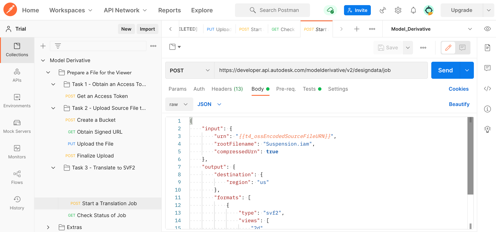
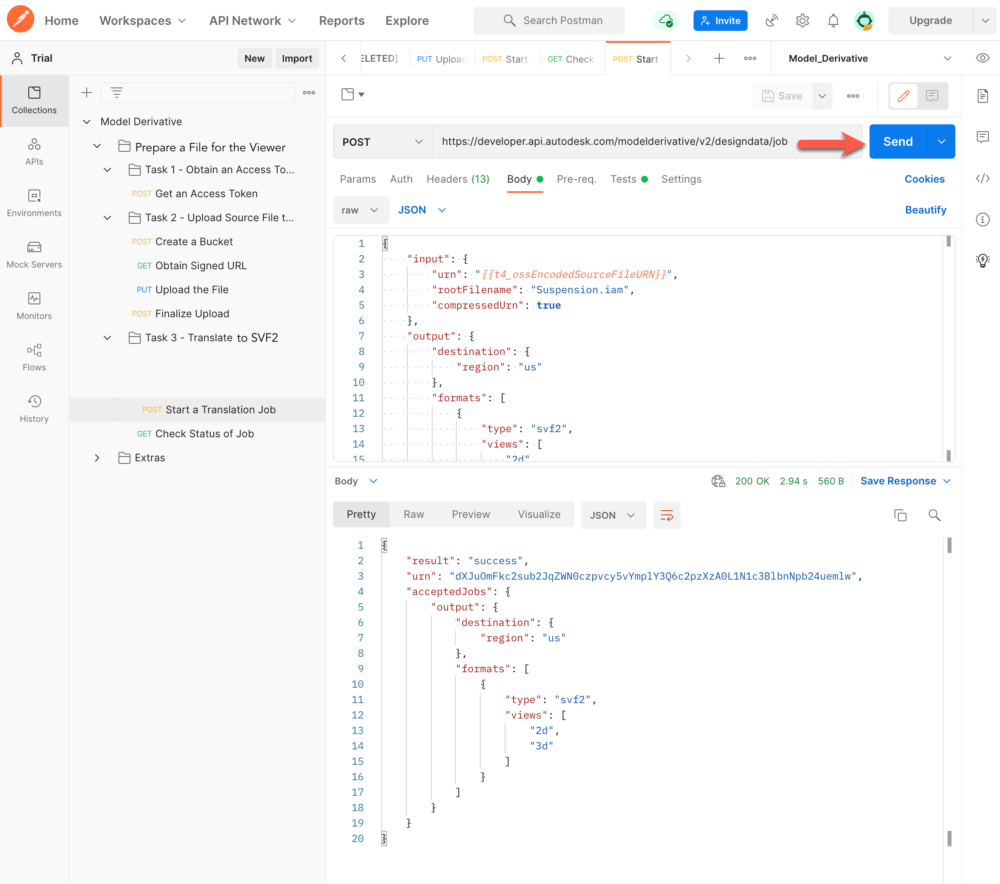
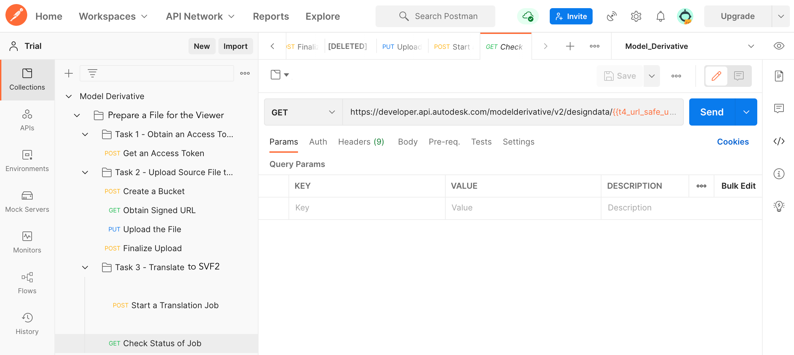
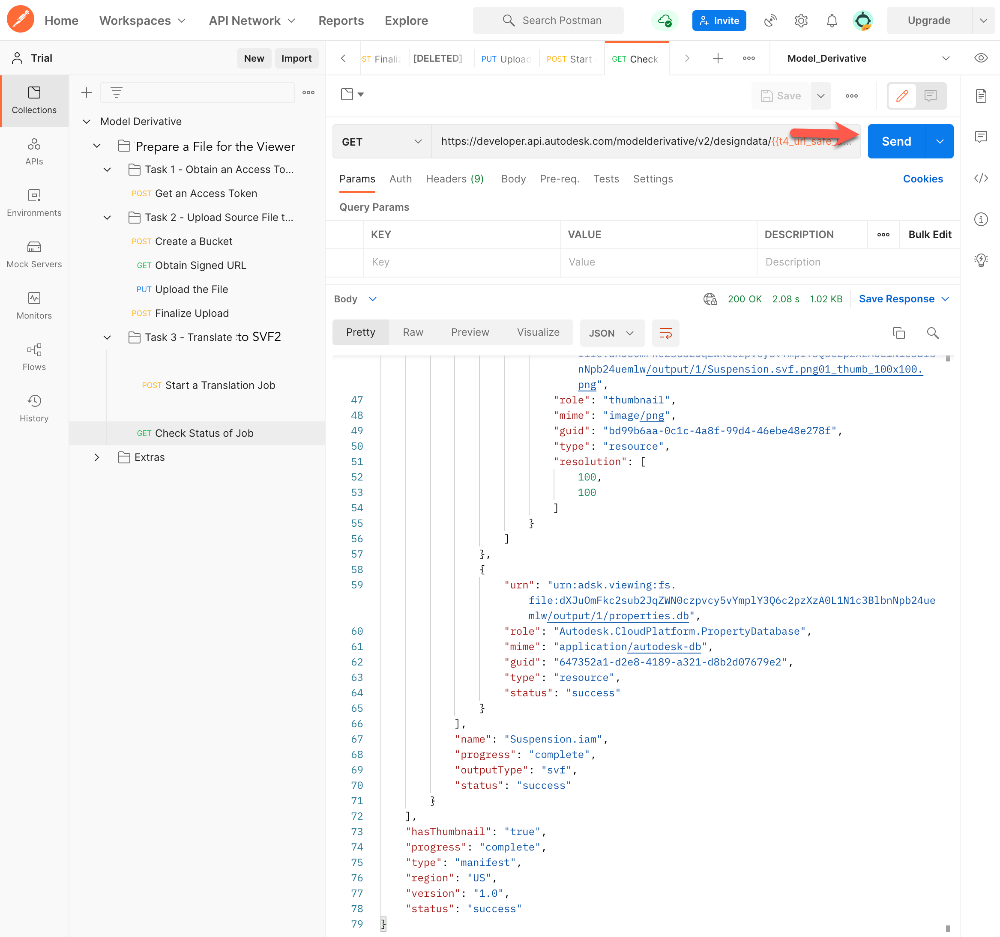

# Task 3 – Translate to SVF2

To translate a model, you must kick off a translation job. The translation job produces a manifest, which lists all the files (derivatives) that are generated. It also reports how far translation has progressed as a percentage, for each derivative listed in the manifest.

## Start a translation job

For this task, you will use the Base64-encoded URN of the source file. In the previous task, Postman saved this value to the variable `t4_ossEncodedSourceFileURN`, which you will use in the next request.

1. In the Postman sidebar, click **Task 3 - Translate to SVF2 > Start a Translation Job**. The request loads.

2. Click the **Body** tab and take note of the JSON payload.

    

    Note the following:

    - `compressedURN` - A flag that tells the system that the source file is within a zip file.

    - `rootfile` - The main source file. In this case, it is the main assembly file, *suspension.iam*, that contains references to the part files found in the zip file.

    - `type` - The file type that the source file must be translated to; SVF2 in this case.

3. Click **Send**. If the request is successful, you should see a screen similar to the following image.

    

    Note the `urn` attribute in the JSON response. The value of this attribute is the URL-safe Base64 encoded URN of the source file. A script in the **Tests** tab, saves this value to a variable named `t4_url_safe_urn_of_source`.

## Check status of translation job

When you kick off a translation job, it takes time to complete. There are two ways to check if the translation job is done:

- Periodically check the status of the translation job.

- Set up a webhook to notify you when the job is done.

For this walkthrough, you check the status of the translation job. For more information on webhooks, see the [documentation on Model Derivative webhook events](https://aps.autodesk.com/en/docs/webhooks/v1/reference/events/model_derivative_events)

1. In the Postman sidebar, click **Task 3 - Translate to SVF2 > Check Status of Job**. The request loads.

   

   Note the use of the URL-safe Base64-encoded URN of the source file as a URI parameter (the `t4_url_safe_urn_of_source` variable)

2. Click **Send**. You will see a screen similar to the following image.

   

   Repeat this step until the `progress` attribute becomes `complete`, as shown in the image.

[:rewind:](../readme.md "readme.md") [:arrow_backward:](task-2.md "Previous task") [:arrow_forward:](task-4.md "Next task")
