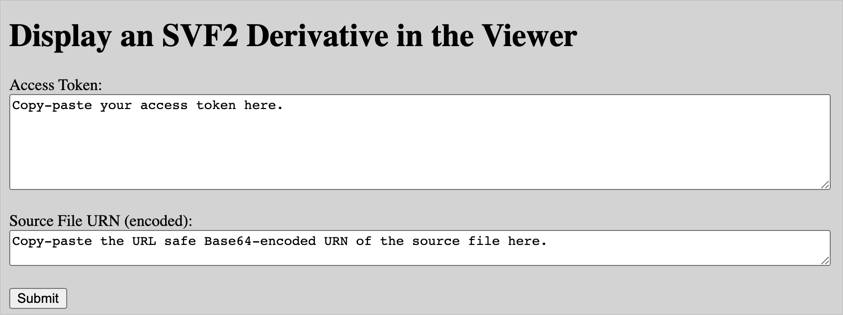
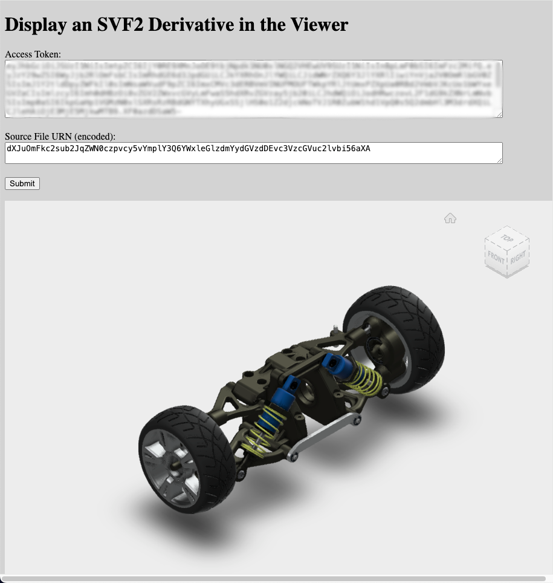

# Task 4 - Display the Model in the Viewer

> **Important:** These instructions are specific to Postman V10. If you are using a newer version of Postman, you may notice slight differences in the interface or steps, but the basic procedure should remain similar.

There are two ways by which you can display the model in the Viewer.

## Option 1: Embed the source file URN in an HTML page you create

1. Insert an instance of the Viewer in an HTML page, and initialize it as per the instructions provided in the following Viewer documentation topics on the APS developer portal:

    a. [Add Viewer to an HTML Page](https://aps.autodesk.com/en/docs/viewer/v7/developers_guide/viewer_basics/starting-html/)

    b. [Intialize Viewer](https://aps.autodesk.com/en/docs/viewer/v7/developers_guide/viewer_basics/initialization/)

    **Note:**

    See the following table for the values to use for this tutorial:

    | Parameter       | SVF2                   |
    |-----------------|------------------------|  
    | `api`           | streamingV2            |
    | `env`           | AutodeskProduction2    |

2. Embed the URL safe Base64-encoded URN of the source file, which you obtained in the previous task, as described in the topic [Load a Model](https://aps.autodesk.com/en/docs/viewer/v7/developers_guide/viewer_basics/load-a-model/)

Note: You must prepend ``urn:`` to the URL safe Base64-encoded URN, when you embed it in the JavaScript code, as shown in the following image.

## Option 2: Provide source file URN as an input to an existing HTML page

We have created a web page based on the instructions provided in Option 1. You can use it to verify the SVF2 file you just generated.

1. Display the webpage by clicking the link in the following table:

| SVF2                                                                                      |
|:----------------------------------------------------------------------------------------:|
|[Show Web page](https://autodesk-platform-services.github.io/aps-tutorial-postman/display_svf2.html) |
|                          |
|[Show Source](../../docs/display_svf2.html)                                                |

2. In the **Access Token** box, specify the access token you obtained in task 1 of this walkthrough.

3. In the **Source File URN (encoded)** box, specify the URL safe Base64-encoded URN of the source file, which you obtained in task 3.

4. Click **Submit**.

   You should see a screen similar to the following image.

   

[:rewind:](../readme.md "readme.md") [:arrow_backward:](task-3_option_2.md "Previous task")
