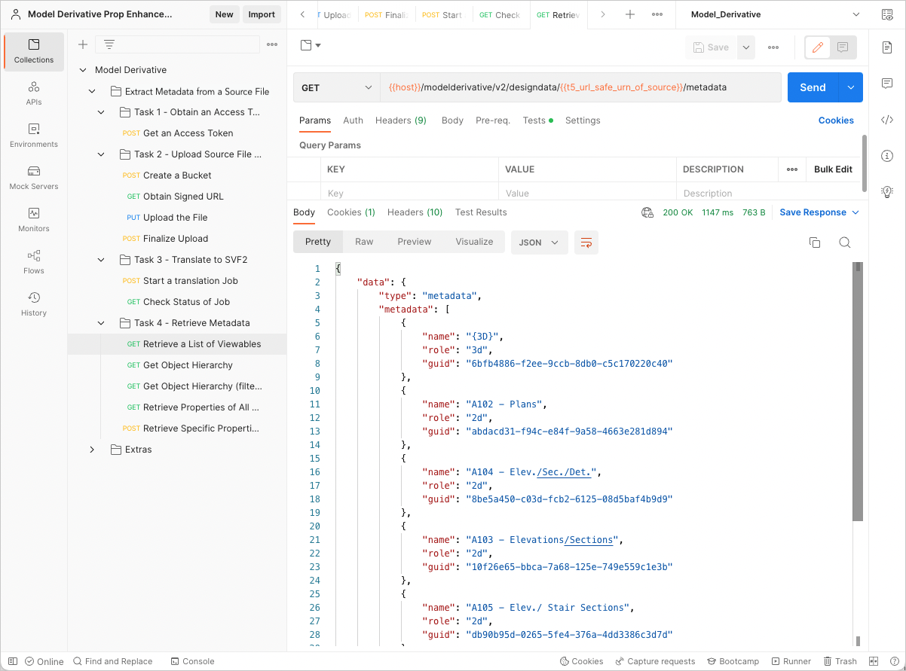
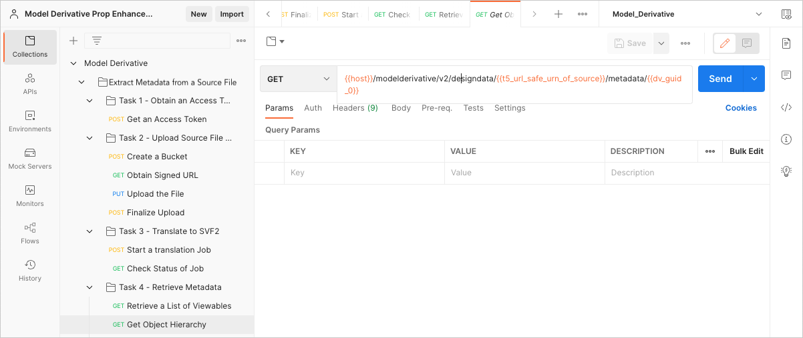
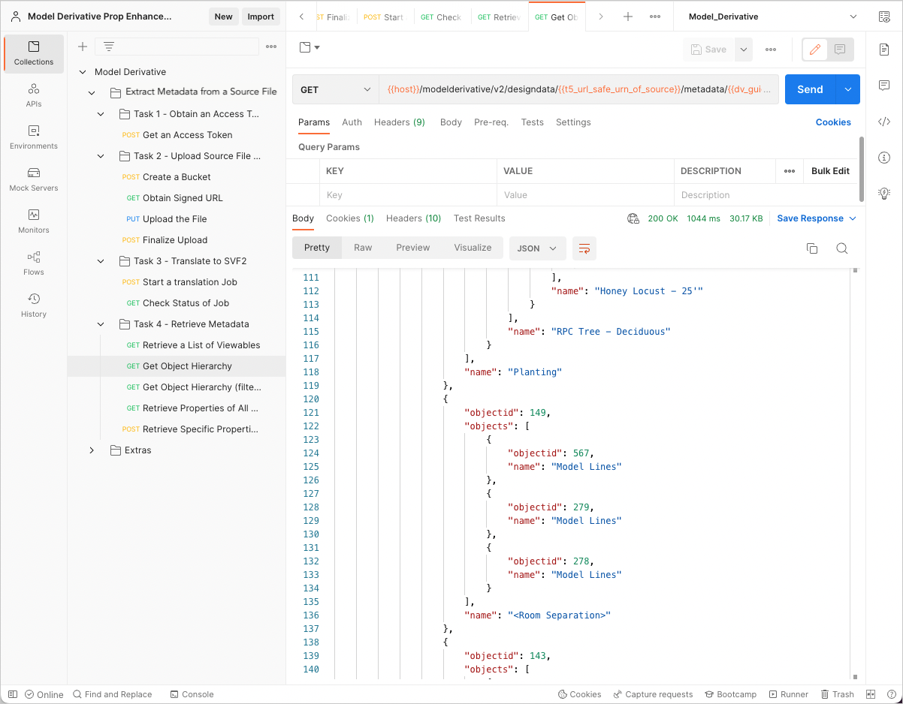
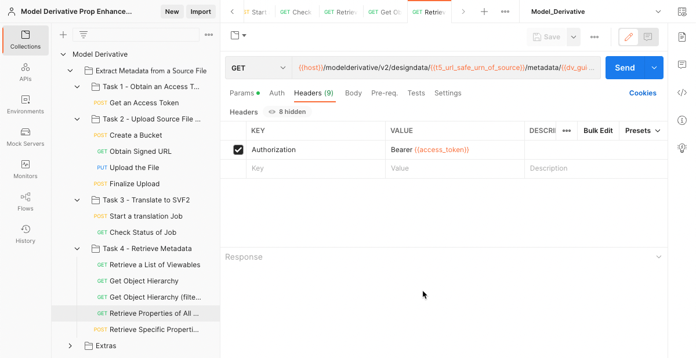
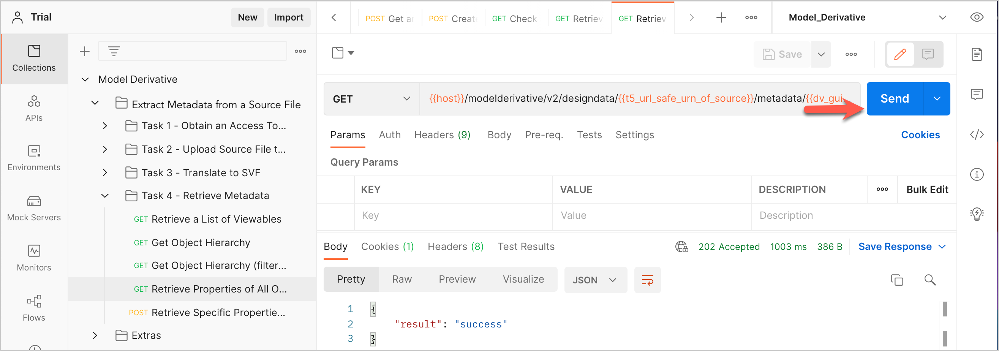
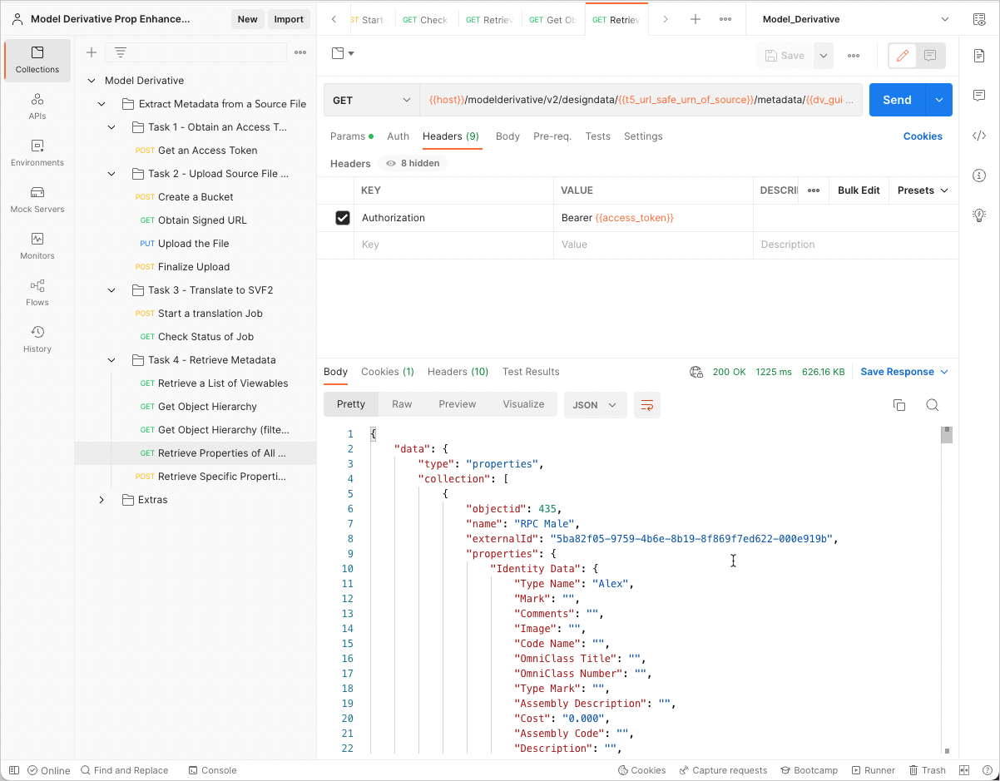
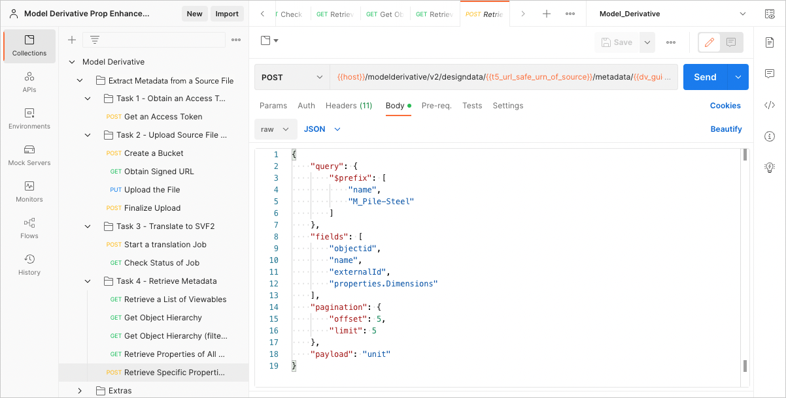
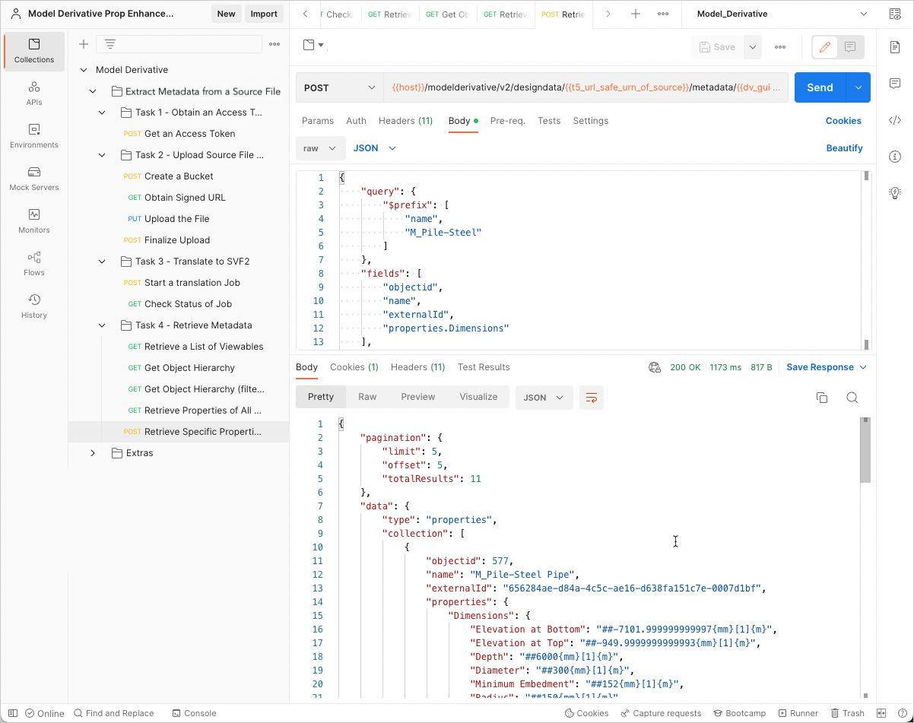

# Task 4 - Extract Metadata

> **Important:** These instructions are specific to Postman V10. If you are using a newer version of Postman, you may notice slight differences in the interface or steps. However, the process should remain similar.

In this task, you extract metadata that was generated in Task 3. Initially you retrieve a list of model views (Viewables) that can be displayed in the viewer. Unlike Inventor and Fusion 360, which contain only one Viewable per source file, Revit files can contain multiple Viewables. The Revit file you used for this walkthrough contains seven Viewables. After you retrieve the Viewables, you select one and use its ID to extract the properties of the objects in the Viewable.

## Retrieve a List of Viewables

To obtain a list of Viewables, you will use the URL safe Base64-encoded Uniform Resource Name (URN) of the source file in the next request. Postman saved this URN to the variable `t5_url_safe_urn_of_source` in the previous task.

1. In the Postman sidebar, click **Task 4 - Retrieve Metadata > Retrieve a List of Viewables**. The request loads.

2. Click **Send**. You should see a screen like the following image.

   

   A script in the **Tests** tab saves the GUIDs of the Viewables to a series of variables: `dv_guid_0` to `dv_guid_6`.

   
   
## Get Object Hierrarchy

Once you know the GUID of a Viewable, you can get the object tree of that Viewable. In the next request you fetch the Object hierrarchy Viewable labeled `{3D}`. The GUID of this Viewable was stored in the Postman environment variable `dv_guid_0`.

1. In the Postman sidebar, click **Task 4 - Retrieve Metadata > Get Object Hierrarchy**. The request loads.

   

   Note the use of the variable `dv_guid_0` as a URI parameter.
   
2. Clicke **Send**. A screen similar to the following is displayed. Note how the object hierrarchy is listed as nested JSON objects.

   

## Retrieve Properties of All Objects in a Viewable

Once you know the GUID of a Viewable, you can get the properties of all objects in that Viewable.

1. In the Postman sidebar, click **Task 4 - Retrieve Metadata > Retrieve Properties of Objects in a  Viewable**. The request loads.

   

   Note the use of the variable `dv_guid_0` as a URI parameter.

2. Click **Send**. If extracting properties takes time, you see a screen like the following.

   

3. Click **Send** again. You should see a screen like the following.

   

The response body contains the list of object properties.

## Retrieve Specific Properties

Notice how large the response was when you requested all properties. You will need to write more code to process the results to get to the information you need.  Alternatively, you can query only the objects you are interested in and request only the properties you need. 

1. In the Postman sidebar, click **Task 4 - Retrieve Metadata > Retrieve Specific Properties of Specific Objects in a  Viewable**. The request loads.

   

   Note how the request body uses:
   
   - The ``query`` attribute to request objects with names that begin with ``M_Pile-Steel``.
   - The ``fields`` attribute to request specifc properties.
   - The ``pagination`` attribute to request a specific page of the paginated results.

2. Click **Send**. You should see a screen similar to the following:

   

[:rewind:](../readme.md "readme.md") [:arrow_backward:](task-3.md "Previous task")

